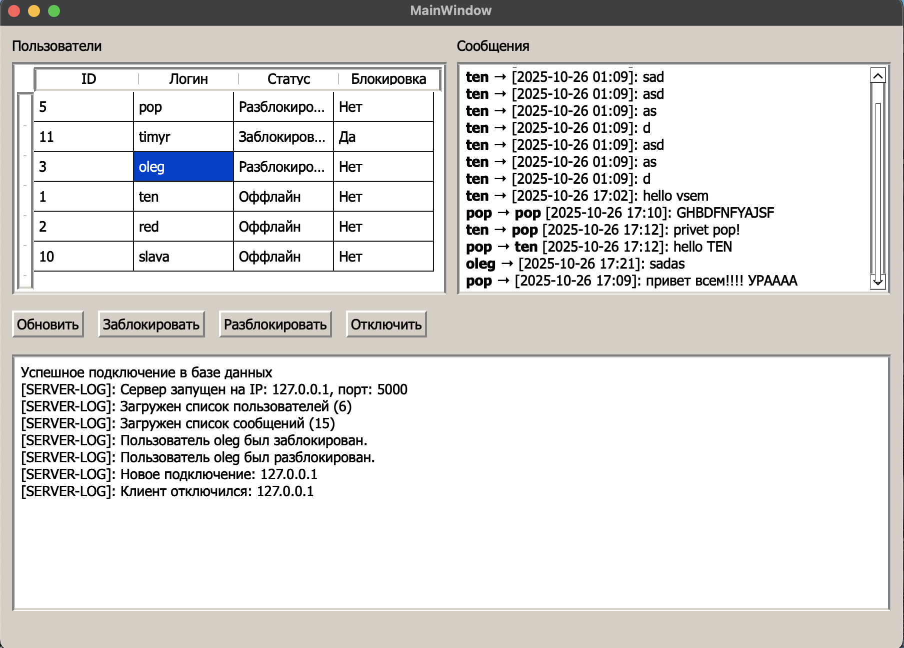

Реализация серверной части на QT 6.9.3
Версия PostgreSQL 17
Реализация GUI для серверной части приложения

Добавлены кнопки обновить, заблокировать, разблокировать, отключить.

Вывод пользователей производится из БД в таблицу.

Вывод сообщений:
ten->[2025-10-26 01:09]:sad  - сообщение всем.
pop → ten [2025-10-26 17:12]: hello - приватное сообщение.

Вывод логов сообщений о подключений, запуске сервера, и других сообщений.

База данных:
create table users (
	id serial primary key,
	username varchar(50) unique not null,
	password text not null,
	status text default 'Оффлайн',
	banned boolean default false
)

create table messages (
    id SERIAL PRIMARY KEY,
    sender VARCHAR(50) NOT NULL,
    receiver VARCHAR(50),
    text TEXT NOT NULL,
    time TIMESTAMP DEFAULT CURRENT_TIMESTAMP
)

